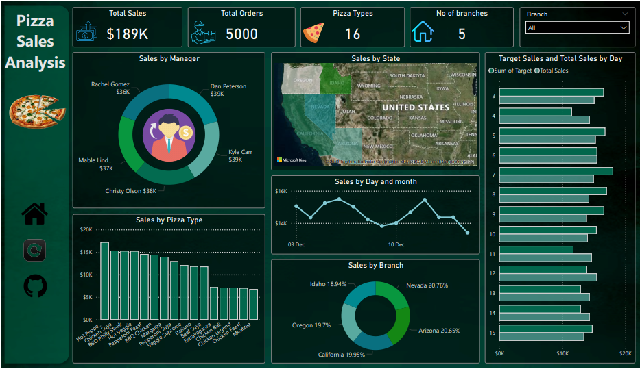
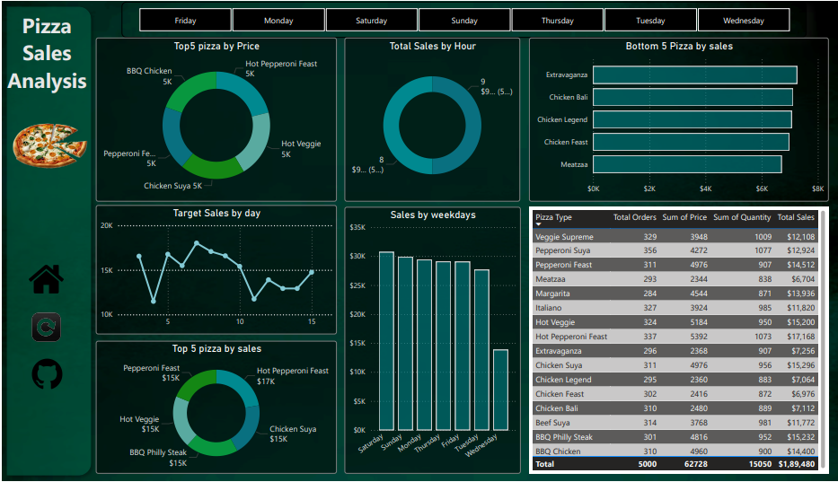

# Pizza-Sales-Analysis
This project leverages Power BI to create an interactive dashboard that provides insights into pizza sales performance, branch operations, and product trends. 
It empowers stakeholders to make data-driven decisions to enhance sales strategies and operational efficiency.

**Objective**: To explore, analyze, and visualize sales performance and branch operations using Power BI.

**Key Features:**

**1)Sales Performance by Region:**
Visualized revenue contribution of branches, 
with Nevada leading at 20.76%.

**2)Product Insights:**
Top-performing pizzas like Hot Pepperoni Feast and Chicken Suya drive significant revenue,

while opportunities exist to improve sales for underperforming pizzas.

**3)Sales Trends:**
Sales peak during weekends and evenings, 
with notable high-performance days exceeding targets.

**4)Manager Comparison:**
Sales managed by Christy Olson and Dan
Peterson consistently lead among all managers.

**5)Overall Metrics:**
Total Revenue: $189K
Total Orders: 5,000
Pizza Types Analyzed: 16

**Technical Details:**
Tools Used: Power BI Desktop
Data Visualization: Charts, slicers, and tables for interactive exploration
Key Metrics Analyzed: Revenue, product performance, sales trends, and manager performance

**Usage:**
Open the Power BI dashboard file in Power BI Desktop.
Use filters and slicers to explore data by region, product, time, and manager.
Analyze insights and take informed actions to improve business performance.

**Conclusion:**
The Pizza Sales Analysis Dashboard provides actionable insights to optimize sales strategies and improve operational efficiency.
It is an invaluable tool for stakeholders aiming to maximize revenue and streamline operations.

